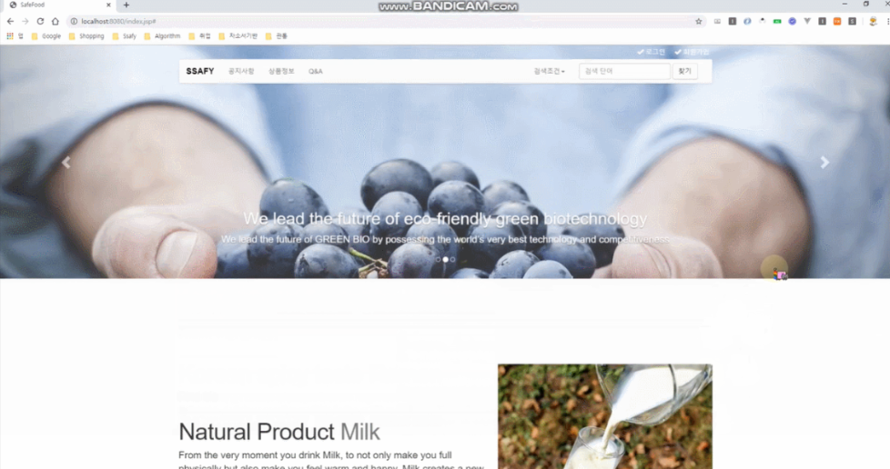
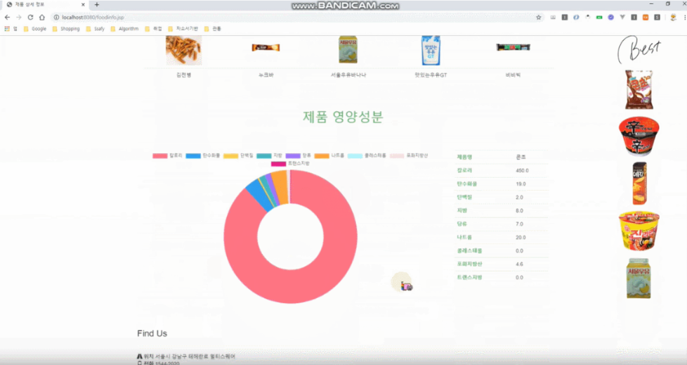
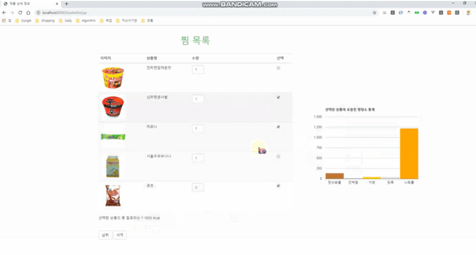
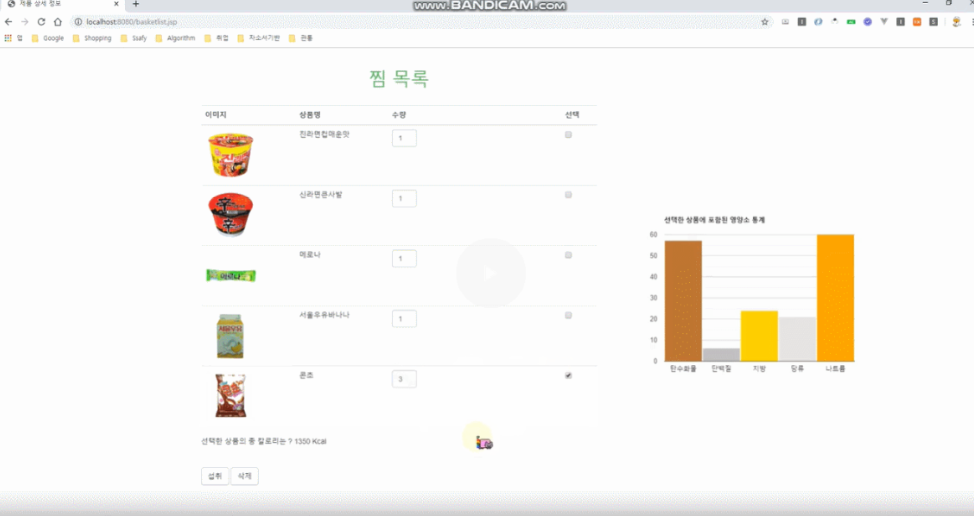

# 🍎 사용자 맞춤 알레르기 알림 사이트 🍎

식품에 포함된 알레르기 성분을 표시하고, 알레르기에 해당한다면 주의 표시를 하여 알레르기를 피할 수 있도록 하며 영양소의 통계를 통해 균형적인 섭취를 돕는 식품 정보 웹사이트입니다.

## 기술스택

JSP, Javascript, Vue, Spring Boot, MySQL, Apache Tomcat

## 담당 역할

Spring Boot 를 이용하여 식품 CRUD, 사용자 CRUD 기능을 위한 REST API 를 구현하였고, JSP와 Javascript 를 이용하여 알레르기 주의 표시, 영양소 통계, 회원가입, 로그인 페이지를 구현하였습니다.

## 메인페이지

식품 데이터가 많아 스크롤이 내려갔을 때, 사용자가 위로 다시 올라갈 필요가 없도록 헤더를 고정하였습니다. 또한 헤더를 통해 바로 식품을 검색할 수 있습니다.

## 알레르기 주의 정보 표시

식품의 상세정보 조회 시 사용자의 알레르기와 일치하는 성분이 포함되어 있다면 다른 색으로 성분을 나타내어 주의 표시를 하였습니다. 또한 식품에 포함되어 있는 영양성분을 그래프로 확인할 수 있습니다. 오른쪽에는 사람들이 많이 조회한 상품 중 상위 5개를 표시합니다.

## 영양소 통계 표시

사용자가 섭취할 식품을 장바구니에 담고, 체크박스를 통해 식품을 선택하면 식품에 포함된 영양성분대로 그래프를 통해 동적으로 표시합니다.